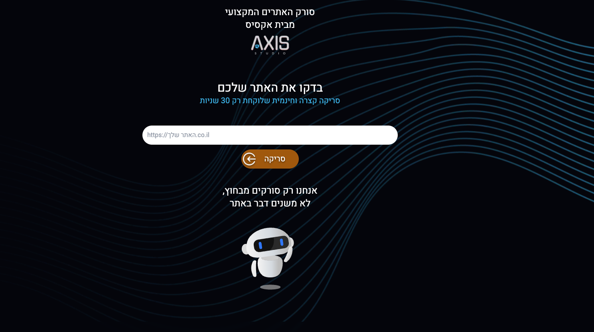
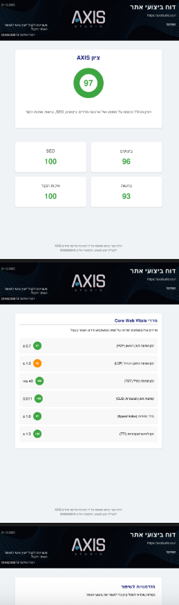
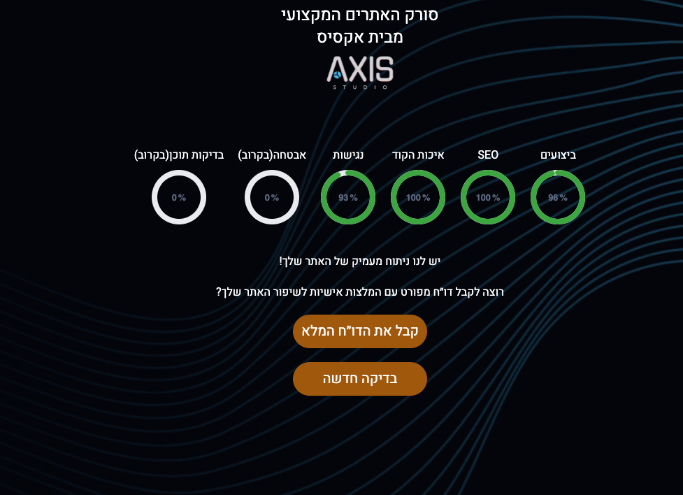

# 🌐 Website Scanner Platform

> Production-grade website performance analysis tool with automated reporting and lead management

[](https://scan.axistudio.co.il)
[](https://nextjs.org/)
[](https://react.dev/)
[](https://www.docker.com/)
[](https://scan.axistudio.co.il)

## 🎯 Overview

A comprehensive website performance analyzer that leverages Google's Lighthouse API to provide detailed performance, SEO, accessibility, and best practices reports. Built for production use and currently serving live traffic at [scan.axistudio.co.il](https://scan.axistudio.co.il).

**[Live Demo](https://scan.axistudio.co.il)** | **[View Screenshots](#-screenshots)**

## ✨ Key Features

### Core Functionality
- **🔍 Automated Website Analysis**: Integration with Google Lighthouse API for comprehensive performance metrics
- **📊 Core Web Vitals**: Real-time measurement of FCP, LCP, TBT, CLS, Speed Index, and TTI
- **📄 PDF Report Generation**: Server-side PDF creation using Puppeteer with professional formatting
- **📧 Email Automation**: Automated report delivery via Resend API
- **📈 Lead Management**: Google Sheets integration for tracking and managing leads

### Technical Features
- **🛡️ Rate Limiting**: Custom middleware to prevent abuse (100 requests/day per IP)
- **🔒 Security**: Origin validation, CORS protection, environment-based secrets
- **🐳 Docker Ready**: Full containerization with optimized multi-stage builds
- **🎨 Modern UI**: RTL support, Framer Motion animations, Tailwind CSS

## 🛠️ Tech Stack

### Frontend
- **Framework**: Next.js 15 (App Router)
- **UI Library**: React 19
- **Styling**: Tailwind CSS 3.4
- **Animations**: Framer Motion
- **Forms**: Custom validation with real-time feedback

### Backend
- **Runtime**: Node.js 18
- **API**: Next.js API Routes
- **PDF Generation**: Puppeteer 23
- **Email**: Resend API
- **Data Storage**: Google Sheets API

### DevOps & Infrastructure
- **Containerization**: Docker + Docker Compose
- **Proxy**: Nginx (Alpine)
- **SSL**: Let's Encrypt via Certbot
- **Hosting**: DigitalOcean Droplet
- **CI/CD**: Manual deployment (Docker image export/import)

### External Services
- **Performance Analysis**: Google PageSpeed Insights API
- **Email Delivery**: Resend
- **Data Management**: Google Sheets API
- **Analytics**: Google Tag Manager

## 📸 Screenshots

- Main scanning interface

- Detailed performance metrics

- PDF report example



## 🚀 Quick Start

### Prerequisites

- Node.js 18+ and npm
- Docker and Docker Compose (optional, for containerized deployment)
- Google Cloud Project with PageSpeed Insights API enabled
- Resend account for email functionality
- Google Service Account with Sheets API access

### Local Development

1. **Clone the repository**
   ```bash
   git clone https://github.com/tomerMGL/website-scanner-platform.git
   cd website-scanner-platform
   ```

2. **Install dependencies**
   ```bash
   npm install
   ```

3. **Set up environment variables**
   ```bash
   cp .env.example .env
   # Edit .env and add your API keys
   ```

4. **Set up Google Service Account**
   - Create a service account in Google Cloud Console
   - Download the JSON key file
   - Place it at `config/google-service-account.json`

5. **Run the development server**
   ```bash
   npm run dev
   ```

6. **Open** [http://localhost:3000](http://localhost:3000)

### Docker Deployment

1. **Build the Docker image**
   ```bash
   docker build -t website-scanner .
   ```

2. **Run with Docker Compose**
   ```bash
   docker-compose up -d
   ```

## 📁 Project Structure

```
website-scanner-platform/
├── src/
│   ├── app/                    # Next.js App Router
│   │   ├── api/               # API routes
│   │   ├── components/        # React components
│   │   ├── constants/         # Constants and configurations
│   │   └── utils/             # Utility functions
│   ├── server/
│   │   ├── services/          # Business logic
│   │   ├── utils/             # Server utilities
│   │   └── assets/            # Server-side assets
│   └── middleware.js          # Rate limiting & security
├── public/                     # Static assets
├── config/                     # Configuration files
├── dockerfile                  # Docker configuration
├── docker-compose.yml         # Docker Compose setup
└── package.json               # Dependencies
```

## 🔧 Configuration

### Environment Variables

See `.env.example` for all required environment variables.

Key configurations:
- `GOOGLE_PAGESPEED_KEY`: Your Google PageSpeed Insights API key
- `RESEND_API_KEY`: Your Resend API key for email sending
- `SHEET_ID`: Google Sheet ID for lead management
- `GOOGLE_APPLICATION_CREDENTIALS`: Path to service account JSON

### Docker Resources

The production deployment is optimized with:
- Memory limit: 768MB
- Memory reservation: 512MB  
- CPU limit: 0.8 cores

## 🏗️ Architecture

```
User Browser
     ↓
Next.js Frontend (React 19)
     ↓
API Routes (Next.js)
     ↓
┌────────┴────────┬──────────────┬───────────────┬──────────┐
↓                 ↓              ↓               ↓          ↓
Google            Puppeteer      Resend      Google     Session
PageSpeed         (PDF Gen)      (Email)     Sheets     Manager
```

## 🔒 Security Features

- **Rate Limiting**: 100 requests per day per IP address
- **Origin Validation**: CORS protection on sensitive endpoints
- **Environment Isolation**: All secrets in environment variables
- **Docker Security**: Read-only volumes for configuration files
- **SSL/TLS**: Let's Encrypt certificates in production

## 📊 Performance

- **Lighthouse Score**: 90+ across all metrics
- **First Contentful Paint**: < 1.5s
- **Time to Interactive**: < 3s
- **Docker Image Size**: ~2.2GB (optimized for Puppeteer)

## 🤝 Contributing

This is a production codebase. If you'd like to suggest improvements:

1. Open an issue describing the enhancement
2. Fork the repository
3. Create a feature branch
4. Submit a pull request

## 📝 License

MIT License - feel free to use this project for learning or commercial purposes.

## 👤 Author

**Tomer Gaziel**

- Website: [axistudio.co.il](https://axistudio.co.il)
- Email: office@axistudio.co.il
- LinkedIn: [Tomer Gaziel](https://linkedin.com/in/tomer-gaziel)

---

**Note**: This repository contains the production source code for a live application. Some sensitive configurations have been sanitized for public viewing. See `.env.example` for required environment variables.
